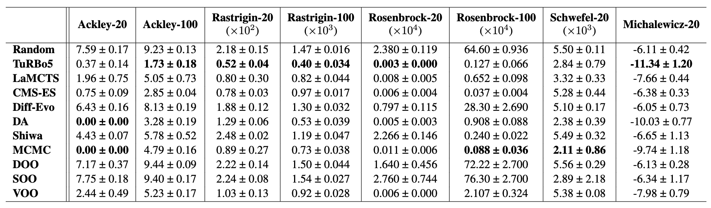

# VLab-Bench

`VLab-Bench` is a suite that offers benchmarks for real-world scientific design tasks and optimisation algorithms for materials science and biology. 

## Current results



## Installation

The code requires `python>=3.9`. Installation Tensorflow and Keras with CUDA support is strongly recommended.

Install `vlab_bench`:

```
pip3 install -e "git+https://github.com/poyentung/VLab-Bench.git"
```

or clone the repository to local devices:

```
git clone git@github.com:poyentung/VLab-Bench.git
cd vlab_bench; pip3 install -e ./
```

**[Optional]** installation of `TurBO` and/or `LaMCTS`

```
git clone git@github.com:poyentung/uber-research/TuRBO.git
pip3 install -e TuRBO/./
```
```
git clone git@github.com:facebookresearch/LaMCTS.git
pip3 install -e LaMCTS/LaMCTS/./
```


## Getting started

Here we evaluate `TuRBO` on `Ackley` in <ins> **10 dimensions** </ins> for <ins> **1,000 samples** </ins> with <ins> **200 initial data points**</ins>.

```
python3 scripts/run.py\
                method=turbo\
                func=ackley\
                dims=10\
                num_samples=20\
                init_samples=200
```

We can also run multiple conditions in a run. For example, we want to evaluate `TuRBO`, `LaMCTS` and `Dual Annealing` on `Ackley` in <ins> **10 dimensions** </ins> for <ins> **1,000 samples** </ins> with <ins> **200 initial data points** </ins>.
```
python3 scripts/run.py -m \
                method=turbo,lamcts,da \
                func=ackley \
                dims=10 \
                num_samples=20 \
                init_samples=200
```

## Available real-world tasks

* Cyclic peptite binder design
* Electron ptychography: reconstruction optimisation

Please send us a PR to add your real-world task!

## Available synthetic function tasks

* Ackley
* Rastrigin
* Rosenbrock
* Schwefel
* Michalewicz
* Griewank

## Available optimisation algorithms

* [TurBO](https://github.com/uber-research/TuRBO)
* [LaMCTS](https://github.com/facebookresearch/LaMCTS)
* [Dual Annealing](https://docs.scipy.org/doc/scipy/reference/generated/scipy.optimize.dual_annealing.html#rbaa258a99356-5)
* [Differential Evolution](https://docs.scipy.org/doc/scipy/reference/generated/scipy.optimize.differential_evolution.html)
* [CMA-ES](https://github.com/CMA-ES/pycma)
* MCMC 
* [Shiwa](https://github.com/facebookresearch/nevergrad)
* [DOO](https://github.com/beomjoonkim/voot)
* [SOO](https://github.com/beomjoonkim/voot)
* [VOO](https://github.com/beomjoonkim/voot)


Please send us a PR to add your algorithm!

## License

The source code is released under the MIT license, as presented in [here](LICENSE).