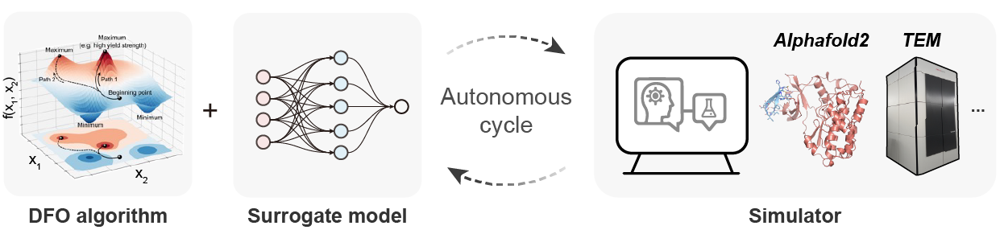
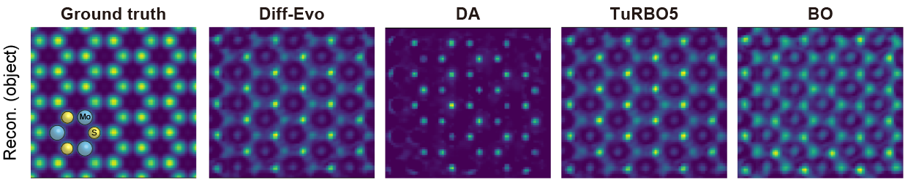
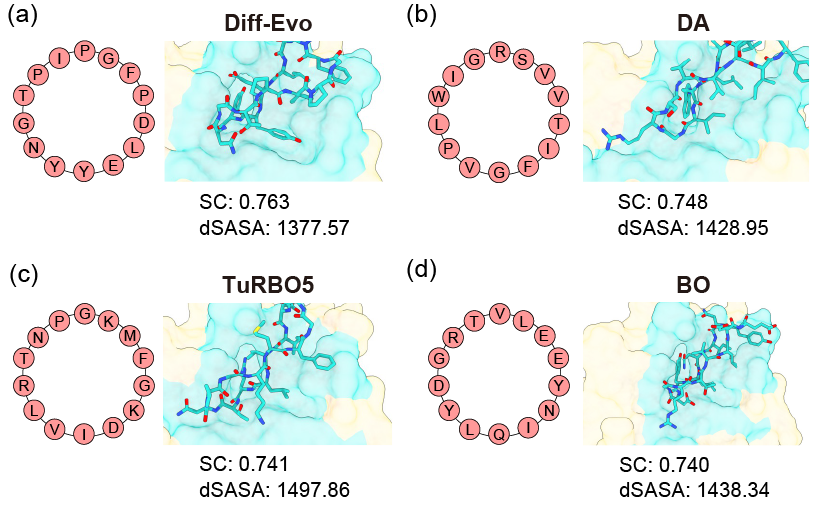

# VLab-Bench

`VLab-Bench` is a suite that offers benchmarks for real-world scientific design tasks and optimisation algorithms for materials science and biology. 

## Benchmark results

### Electron ptychography

The reconstructed phases (of the object transmission functions) with parameters obtained from the corresponding DFO methods on a MoS2 dataset.

### Cyclic peptide

The peptide sequence and the corresponding interaction map for protein 4kel derived from various DFO methods.

### Synthetic functions

Results are averaged over 5 trials, and ± denotes the standard deviation.

## Installation

The code requires `python>=3.10`. Installation Tensorflow and Keras with CUDA support is strongly recommended.

Install `vlab_bench`:

```
pip install -e "git+https://github.com/poyentung/VLab-Bench.git"
```

or clone the repository to local devices:

```
git clone https://github.com/poyentung/VLab-Bench.git
cd VLab-Bench; pip install -e ./
```

**[Optional]** Install `TurBO` and/or `LaMCTS`

```
git clone https://github.com/uber-research/TuRBO.git
pip install TuRBO/./
```
```
git clone https://github.com/facebookresearch/LaMCTS.git
pip install LaMCTS/LA-MCTS/./
```

**[Optional]** Install `py4DSTEM`

```
pip install py4dstem
```
Or check installation for [GPU acceleration](https://py4dstem.readthedocs.io/en/latest/installation.html#).

**[Optional]** Install `pyrosetta` and `colabdesign` for cyclic peptide design.

Referring to [pyrosetta](https://www.pyrosetta.org/downloads) and [colabdesign](https://github.com/sokrypton/ColabDesign/tree/main/af)
## Getting started

### Virtual lab examples

We run parameter optimization for electron ptychography using [TuRBO](vlab_bench/algorithms/_turbo.py) on a MoS2 dataset in <ins> **14 dimensions** </ins> for <ins> **20 samples** </ins> with <ins> **30 initial data points**</ins>. Note that `num_samples` should include the `init_samples` for [TuRBO](vlab_bench/algorithms/_turbo.py) and [LaMCTS](vlab_bench/algorithms/_lamcts.py), i.e., `num_samples=50` and `init_samples=30` represent 20 aquisition of samples (50 - 30 = 20). More detailed hyper-parameters can be adjusted in the [run_pytho.yaml](scripts/conf/run_ptycho.yaml).

```
python scripts/run_ptycho.py method=turbo \
                             func=ptycho \
                             dims=14 \
                             num_samples=50 \
                             init_samples=30
```

### Synthetic function examples

We evaluate [TuRBO](vlab_bench/algorithms/_turbo.py) on `Ackley` in <ins> **10 dimensions** </ins> for <ins> **1,000 samples** </ins> with <ins> **200 initial data points**</ins>. Note that `num_samples` should include the `init_samples` for [TuRBO](vlab_bench/algorithms/_turbo.py) and [LaMCTS](vlab_bench/algorithms/_lamcts.py), i.e., `num_samples=1000` and `init_samples=200` represent 800 aquisition of samples (1000 - 200 = 800). More detailed hyper-parameters can be adjusted in the [run.yaml](scripts/conf/run.yaml).

```
python scripts/run.py method=turbo \
                      func=ackley \
                      dims=10 \
                      num_samples=1000 \
                      init_samples=200
```

We can also run multiple conditions in a run. For example, we want to evaluate `MCMC`, `CMA-ES` and `Dual Annealing` on `Ackley` in <ins> **10 dimensions** </ins> for <ins> **1,000 samples** </ins> with <ins> **200 initial data points** </ins>.
```
python scripts/run.py -m method=mcmc,cmaes,da \
                         func=ackley \
                         dims=10 \
                         num_samples=20 \
                         init_samples=200
```

## Available real-world tasks

* [Cyclic peptide binder design](scripts/run_peptide.py)
* [Electron ptychography](scripts/run_ptycho.py)

Please send us a PR to add your real-world task!

## Available synthetic function tasks

* Ackley
* Rastrigin
* Rosenbrock
* Schwefel
* Michalewicz
* Griewank

## Available optimisation algorithms

* [TurBO](https://github.com/uber-research/TuRBO)
* [LaMCTS](https://github.com/facebookresearch/LaMCTS)
* [Dual Annealing](https://docs.scipy.org/doc/scipy/reference/generated/scipy.optimize.dual_annealing.html#rbaa258a99356-5)
* [Differential Evolution](https://docs.scipy.org/doc/scipy/reference/generated/scipy.optimize.differential_evolution.html)
* [CMA-ES](https://github.com/CMA-ES/pycma)
* MCMC 
* [Shiwa](https://github.com/facebookresearch/nevergrad)
* [DOO](https://github.com/beomjoonkim/voot)
* [SOO](https://github.com/beomjoonkim/voot)
* [VOO](https://github.com/beomjoonkim/voot)


Please send us a PR to add your algorithm!

## License

The source code is released under the MIT license, as presented in [here](LICENSE).